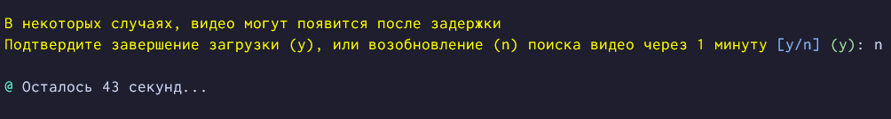

Небольшая утилита, которая поможет скачать все видео из профиля, или по тегу.  
Использует **Selenium** для загрузки страниц, по этому понадобится **Google Chrome**.  
Перед запуском ничего делать не нужно, все зависимости скачаются сами.  
Для вывода используется [Spectre.Console](https://github.com/spectreconsole/spectre.console). Файлы качает [yt-dlp](https://github.com/yt-dlp/yt-dlp).  
Управление `Google Chrome` реализовано так, что бы имитировать человека, и использует методы [SeleniumStealth .NET](https://github.com/LibardiFelipe/SeleniumStealth.NET), по этому каптча вылезает довольно редко.  

### Запуск
  

### Подсветка результатов выполнения на странице

#### TikTok довольно таки строг к разного рода автоматизациям, по этому есть возможность продолжить загрузку, через какое то время, если кажется, что TikTok перестал отображать видео после долгой загрузки.

### Загрузка завершится после подтверждения пользователя

